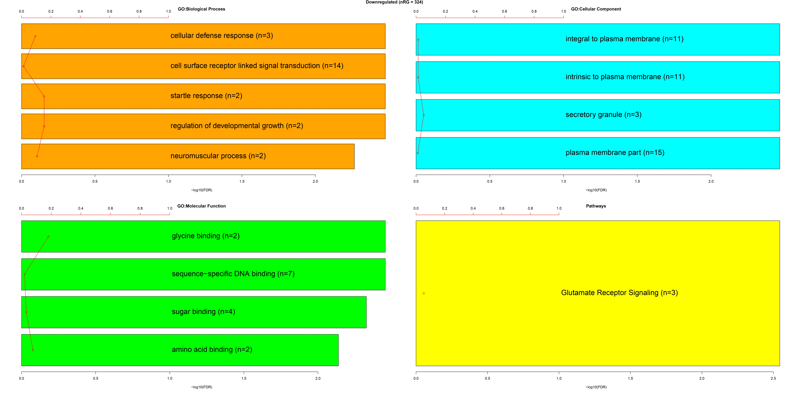
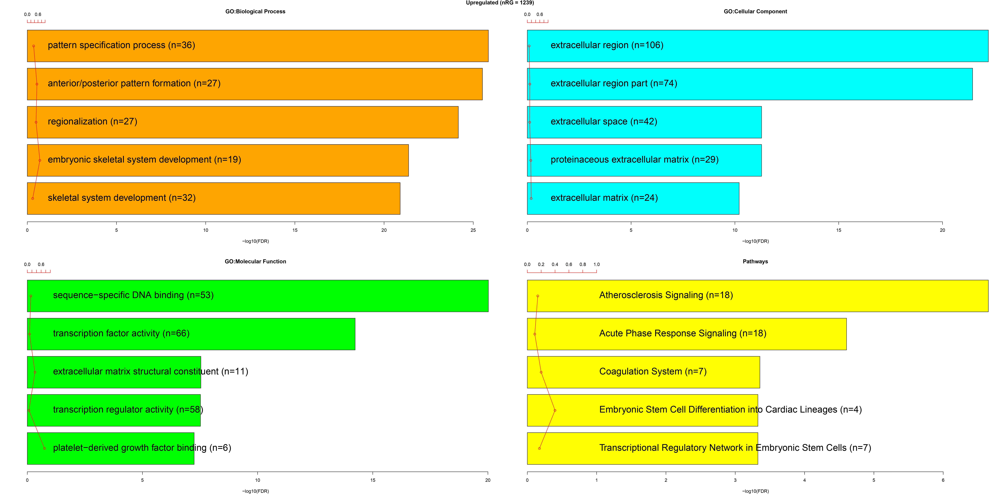
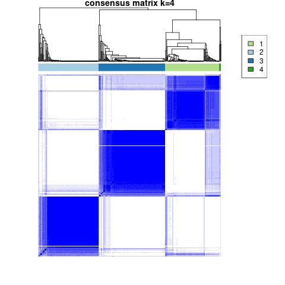

<h2 align="center">  Unravelling Glioma Heterogeneity through Unsupervised Clustering using Transcriptomic Profiling and Machine Learning </h2>

<a align="center"> Table of Contents: </a>
  <a href="#Introduction"> Introduction </a> |
  <a href="#Materials-and-Methods"> Materials and Methods </a> | 
  <a href="#Results"> Results </a> | 
  <a href="#Conclusion"> Conclusion </a> |
  <a href="#References"> References </a> |
  <a href="#Contributors"> Contributors </a> 
</a>

## Introduction:
Gliomas are primary brain tumors that arise from glial cells and are classified according to their histological characteristics and grade. Glioma biology depends heavily on mutations in isothiolate dehydrogenase (IDH), which affect prognosis and response to treatment(Zhou et al., 2020). Furthermore, glioma patients seem to fare better when there is substantial methylation, especially of the O6-methylguanine-DNA methyltransferase (MGMT) gene(Hegi et al., 2005).  Identifying IDH status and methylation patterns helps with patient stratification for gliomas and customized treatment strategies(Louis et al., 2016).
This study aims to classify IDH mutation status in low-grade gliomas (LGG) using transcriptomic data from the TCGA-LGG dataset. By leveraging differential gene expression analysis and machine learning models, the goal is to build a predictive model for IDH status and identify transcriptomic subtypes of LGG through unsupervised agglomerative hierarchical consensus clustering.

## Materials and Methods:
Transcriptome profiling data for low-grade glioma was obtained from the TCGA-LGG dataset, including 513 samples (94 IDH wild types and 419 IDH mutants). Low-expression genes were filtered out. Differential expression analysis between IDH wild type and mutants was performed using TCGAbiolinks in R, with criteria of Fdr ≤ 0.01 and logFC ≥ 2. Results were visualized with heatmaps and volcano plots, and enrichment analysis was conducted after mapping Ensembl IDs to gene IDs.
This study aimed to identify IDH status-associated biomarkers in low-grade glioma using ML analysis. After cleaning and transposing RNA-seq data, feature selection was done via variance thresholding. A Random Forest classifier was trained with class weights to handle the class imbalance, and performance was evaluated using accuracy, classification reports, confusion matrix, ROC, and precision-recall curves. Unsupervised clustering using the ConsensusClusterPlus R package, based on a Pearson distance matrix, identified K = 4 as the optimal number of clusters. The IDH mutation status was used to annotate and interpret clusters, and its distribution across clusters was visualized via a bar chart.

## Results:
Gene expression profiles from TCGA-LGG were used to compare IDH wild types and IDH mutants. RNAseq data revealed several DEGs. The volcano plot showed a distinct clustering of IDH wild types and IDH mutants. Out of all gene enrichment analyses highlighted, extracellular matrix, transcription, and pattern formations were upregulated while different binding functions and cellular receptor signaling were downregulated. 

    
     Fig : 

   Fig :
  Fig :

  

     Fig : 

    
     Fig : 

The ML model was evaluated using a confusion matrix, classification report, accuracy, and ROC curve. The model has an overall accuracy of 98%. The precision was 98% for mutants and 100% for WT. The true positive rate for mutants was 100%, while it was 89% for WT as the minority class. The F1-scores were 0.99 and 0.94 for mutants and WT, respectively. The ROC’s AUC was 1, indicating strong classification performance.
The consensus clustering analysis with K = 4 identified four distinct and stable expression clusters, as indicated by the clear block structures in the consensus matrix. Samples within these clusters exhibited high consensus, suggesting reliable grouping across multiple clustering iterations. 

The distribution of IDH mutation status (Mutant/WT) across the clusters revealed that the majority of Mutant samples were concentrated in three clusters, while WT samples were more evenly distributed but less frequent overall. These findings suggest a potential association between IDH mutation status and expression-based clusters, which could provide valuable insights into the molecular subtypes of the samples analyzed. Further biological interpretation is required to explore the functional significance of these clusters to IDH mutation.

    
     Fig : 

    
     Fig : 

    
     Fig : 

    
     Fig : 

## Conclusion:
## References:
Ceccarelli, M., Barthel, F. P., Malta, T. M., Sabedot, T. S., Salama, S. R., Murray, B. A., Morozova, O., Newton, Y., Radenbaugh, A., Pagnotta, S. M., Anjum, S., Wang, J., Manyam, G., Zoppoli, P., Ling, S., Rao, A. A., Grifford, M., Cherniack, A. D., Zhang, H., . . . Zmuda, E. (2016). Molecular profiling reveals biologically discrete subsets and pathways of progression in diffuse glioma. Cell, 164(3), 550–563. https://doi.org/10.1016/j.cell.2015.12.028

### Contributors
|Name|Slack ID|Linkedin|
| ----------- |----------- |----------- |
|Ayooluwa Joseph|@Jay1079| <a href="https://www.linkedin.com/in/ayooluwa-joseph/" target="_blank">	LinkedIn Profile</a> |
|Edikan Umoh|@usiwomaumoh| <a href="https://www.linkedin.com/in/edikan-umoh/" target="_blank">	LinkedIn Profile</a>|
|Lewis Karani|@Karani|<a href="https://www.linkedin.com/in/lewis-karani/" target="_blank">	LinkedIn Profile</a>|
|Monsurah Bisola Alatise|@AlatiseMB| <a href="https://www.linkedin.com/in/monsurah-bisola-alatise-b58a33225/" target="_blank">	LinkedIn Profile</a> |
|Nishat Tamanna|@Nishat| <a href="https://www.linkedin.com/in/nishat-tamanna-45863117a/" target="_blank">	LinkedIn Profile</a>|
|Shalaka More|@shalaka| <a href="https://www.linkedin.com/in/shalaka-more-03277913b/" target="_blank">	LinkedIn Profile</a>  |
|Sreeja Mondal|@sreeja| <a href="https://linkedin.com/in/sreejamondal263/" target="_blank">	LinkedIn Profile</a> |
|Owolabi Oluwatosin|@Oluwatosin| <a href="https://www.linkedin.com/in/owolabi-oluwatosin-a9063830b/" target="_blank">	LinkedIn Profile</a> |

